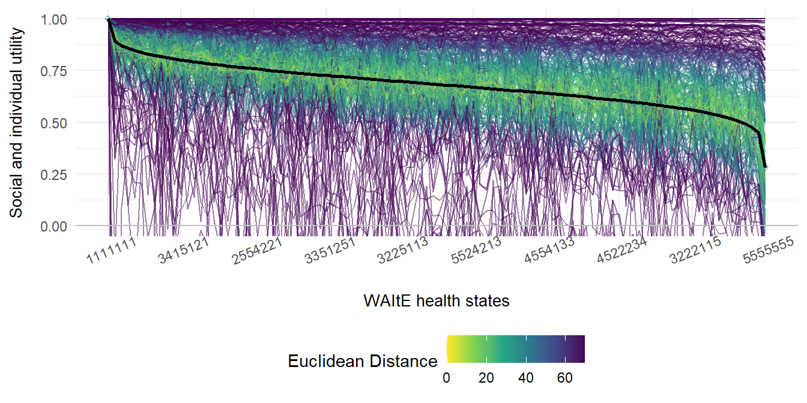
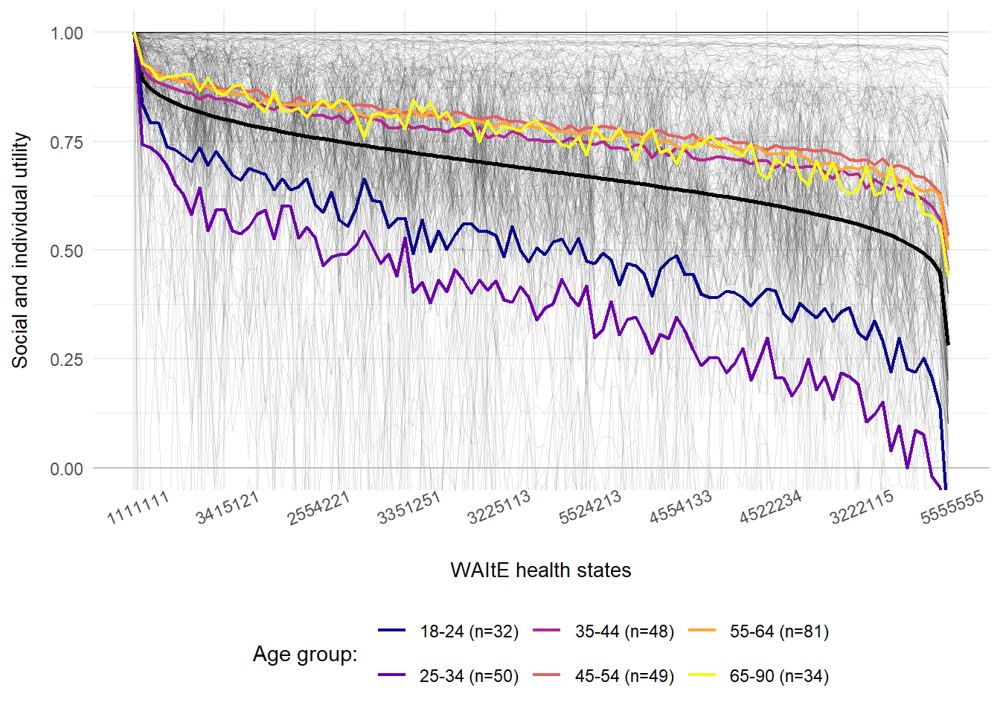

*Disclaimer:* This is a work-in-progress, please do not redistribute or cite without the authors permission. This work was supported by the NIHR-ARC and Newcastle University. 

*Acknowledgements:* We would like to thank Paul Schneider and Valorem Health for collaborating on this project.

*Code availability:* An interactive document (HTML) which includes the live survey is available [here](https://willking98.github.io/opuf-adult/). Source code for the analysis and this Quarto generated PDF are available [here](https://github.com/willking98/opuf-adult).


::: {.cell}

:::


# Introduction {#sec-introduction}


::: {.cell}

:::


## Compositional preference elicitation methods

Preference elicitation methods typically, fall into two categories: compositional and decompositional [@Keeney1979DecisionsTrade-Offs; @Marsh2016MultipleForce; @Belton2002MultipleAnalysis]. That is, methods such as DCE, BWS and TTO elicit preference orderings from individuals for an entire health state (composed of a combination of attributes and levels) and then responses are decomposed to identify marginal contributions of each attribute and level in each health state. Models like multinomial logit, mixed logit and latent class are frequently used to decompose responses to decompositional preference elicitation tasks [@Hauber2016StatisticalForce]. Coefficients estimated in these models form the basis of dis/utility values for each attribute and level in a descriptive system. 

Conversely, compositional methods seek to identify preferences for each attribute weighting and level rating individually for the number of attributes and levels in a given descriptive system. Therefore, statistical models to elicit coefficients for each individual attribute and level are not required and responses to each attribute weighting and level rating are combined (in addition to an anchoring factor) to yield dis/utility values for each attribute and level in the descriptive system. Compositional approaches can take many forms from simple VAS scores to using semantic categories and ranking methods [@BanaECosta1999TheApplication; @Danner2011IntegratingPreferences; @Oliveira2018ValuingStates]. These approaches have previously been used successfully in multi-criteria decision analysis (MCDA), but have been used less extensively in the preference elicitation space. Since the development of the OPUF, compositional approaches to elicit preferences have become more commonplace and a number of countries are using the OPUF to elicit value sets specific to their population [@Brodszky2023PCR108States]. 

## From PUF to OPUF
Personal utility functions (PUF) were first used in the context of preference elicitation by Devlin et al. (2019) [@Devlin2019AFunctions] to estimate the feasibility for using this approach to estimate a value set for the EQ-5D-5L. Since the feasibility for the underlying PUF methods were established, the approach has been expanded by Schneider and colleagues [@Schneider2022TheStates] and converted into an online personal utility functions (OPUF) survey built initially using RShiny and subsequently using Javascript (available [here](https://eq5d5l.me)). Since the development of the OPUF, a number of descriptive systems and different research teams have begun using this method to elicit value sets [@Bray2024DevelopmentImpairment; @Brodszky2023PCR108States].  

## An overview of the OPUF structure
### Attribute weighting 
This section is composed of two parts. First, attribute ranking is completed where participants identify their most important attribute (@fig-importantattribute). Second, respondents complete the attribute weighting (swing weighting) where the relative importance of other attributes is ascertained using their most important attribute as a reference point (@fig-swing). These questions are presented in @fig-attribute. 

::: {#fig-attribute layout-ncol=2}

{#fig-importantattribute}

{#fig-swing}

Attribute weighting
:::

### Level ratings 
This element of the OPUF has varied across different iterations of the survey. Schnieder et al. (2022) [@Schneider2022TheStates] asked participants to rank the levels within the descriptive system generally (i.e. for any given attribute), while other iterations have administered separate level rating questions for each attribute in the descriptive system [@Bray2024DevelopmentImpairment]. Selection of method requires a trade-off between participant burden and sensitivity of level ratings to each attribute. @fig-level presents the level rating question for the tiredness and treated differently attributes of the WAItE. 

::: {#fig-level layout-ncol=2}

{#fig-levelrating}

{#fig-levelrating2}

Level rating
:::

\newpage

### Anchoring factor 
A task is required to rescale the latent coefficients estimated via combining level ratings and attribute weights onto the QALY scale. Participants are presented with a binary choice between the PITS state (or another state) of a given descriptive system and "being dead" (@fig-anchor1). If the PITS state is chosen, participants are asked to rank the PITS state on a VAS from 1 (full health) to 0 (dead). If "being dead" is chosen, participants are asked to rank "being dead" on a VAS from 1 (full health) to 0 (PITS state) (@fig-anchor2). Responses to these respective questions provide the anchoring factor. Anchoring questions, such that PITS is preferred to dead, are presented in @fig-anchoring.

::: {#fig-anchoring layout-ncol=2}

{#fig-anchor1}

{#fig-anchor2}

Anchoring factor
:::

## OPUF logic and mathematics {#sec-OPUF_methods}
This section presents the logic and underlying mathematics required to convert the raw OPUF responses from one person into an anchored value set for the WAItE descriptive system. This example assumes that level ratings are obtained for each attribute separately, therefore the mathematics presented here differs to those presented elsewhere [@Schneider2022TheStates]. Example response data are used for demonstration in this section and are presented in @tbl-exampledata. 

\newpage

### Example responses


::: {.cell}

:::

::: {#tbl-exampledata .cell tbl-cap='Example individual responses to the OPUF'}
::: {.cell-output-display}


|Response                   | Tired| Walking| Sports| Concentration| Embarrassed| Unhappiness| Treated|
|:--------------------------|-----:|-------:|------:|-------------:|-----------:|-----------:|-------:|
|Level rating: Never        |     0|       0|      0|             0|           0|           0|       0|
|Level rating: Almost Never |    14|      26|     21|            15|          16|          12|      19|
|Level rating: Sometimes    |    57|      55|     63|            54|          38|          26|      66|
|Level rating: Often        |    83|      82|     85|            86|          64|          38|      91|
|Level rating: Always       |   100|     100|    100|           100|         100|         100|     100|
|Attribute Weighting        |    28|      33|     36|            45|         100|          34|      56|


:::
:::


Level ratings (presented in @tbl-exampledata)  are converted to coefficients bounded between 0-1 (shown in @eq-level-rescale). Level rating coefficients are presented in @eq-level-matrix. Attribute weights (presented in @tbl-exampledata) are then normalised to sum to the value of 1 by dividing each weight by the sum of all weights (shown in @eq-weight-normalise). Normalised attribute weights are presented in @eq-weight-vector. 

$$
    L_{ij} \cdot 0.01
$$ {#eq-level-rescale}

$$
L_{ij} = 
\begin{bmatrix}
0 & 0 & 0 & 0 & 0 & 0 & 0 \\
0.14 & 0.26 & 0.21 & 0.15 & 0.16 & 0.12 & 0.19 \\
0.57 & 0.55 & 0.63 & 0.54 & 0.38 & 0.26 & 0.66 \\
0.83 & 0.82 & 0.85 & 0.86 & 0.64 & 0.38 & 0.91 \\
1 & 1 & 1 & 1 & 1 & 1 & 1 \\
\end{bmatrix}
$$ {#eq-level-matrix}

$$
    \frac{w_{j}}{\sum{w_j}}
$$ {#eq-weight-normalise}

$$
w_j = \begin{bmatrix}
    0.08& 0.10& 0.11& 0.14& 0.30& 0.10& 0.17
\end{bmatrix} 
$$ {#eq-weight-vector}


Combining the attribute weights (@eq-weight-vector) with the level coefficients (@eq-level-matrix) via element-wise multiplication (shown in @eq-element-wise-multiplication gives the coefficient matrix presented in @eq-coeff-matrix. Once the coefficient matrix has been estimated, preference values can be estimated on the 0-1 QALY scale where the worst health state (PITS state denoted 5555555) is zero and the best health state (denoted 1111111) is one. These latent coefficients must now be rescaled to incorporate the results from the PITS anchoring task so that the minimum utility value possible is equal to the PITS value. 

$$
    L_{ij} \cdot  w_{j} = {M}_{ij}
$$ {#eq-element-wise-multiplication}

$$
M_{ij} =  
\begin{bmatrix}
0 & 0 & 0 & 0 & 0 & 0 & 0 \\
0.01 & 0.03 & 0.02 & 0.02 & 0.05 & 0.01 & 0.03 \\
0.05 & 0.05 & 0.07 & 0.07 & 0.11 & 0.03 & 0.11 \\
0.07 & 0.08 & 0.09 & 0.12 & 0.19 & 0.04 & 0.15 \\
0.08 & 0.10 & 0.11 & 0.14 & 0.30 & 0.10 & 0.17
\end{bmatrix}
$$ {#eq-coeff-matrix}

To rescale the latent coefficient matrix to incorporate the anchoring task, the coefficient matrix is multiplied by the compliment of the PITS value (shown in @eq-anchoring) to give the anchored coefficient matrix presented in @eq-anchored-matrix. 

$$
    M_{ij} \cdot (1-P) \quad \backepsilon \quad P = 0.2 
$$ {#eq-anchoring}

$$
V_{ij} =  
\begin{bmatrix}
0 & 0 & 0 & 0 & 0 & 0 & 0 \\
0.01 & 0.02 & 0.02 & 0.02 & 0.04 & 0.01 & 0.02 \\
0.04 & 0.04 & 0.06 & 0.06 & 0.09 & 0.02 & 0.09 \\
0.06 & 0.06 & 0.07 & 0.10 & 0.15 & 0.03 & 0.12 \\
0.06 & 0.08 & 0.09 & 0.11 & 0.24 & 0.08 & 0.14 \\
\end{bmatrix}
$$ {#eq-anchored-matrix}

Once the attribute and level labels are reintroduced to the anchored coefficient matrix this forms the value set which presents the disutility corresponding to each attribute level combination presented in the WAItE. @tbl-example-valueset presents the WAItE example PUF value set. @eq-HS123 provides examples of how to estimate a utility value given a specific WAItE health state. 


::: {.cell}

:::

::: {#tbl-example-valueset .cell tbl-cap='WAItE example PUF value set'}
::: {.cell-output-display}


|Attribute level | Tired| Walking| Sports| Concentration| Embarrassed| Unhappiness| Treated|
|:---------------|-----:|-------:|------:|-------------:|-----------:|-----------:|-------:|
|Never           |  0.00|    0.00|   0.00|          0.00|        0.00|        0.00|    0.00|
|Almost Never    |  0.01|    0.02|   0.02|          0.02|        0.04|        0.01|    0.02|
|Sometimes       |  0.04|    0.04|   0.06|          0.06|        0.09|        0.02|    0.09|
|Often           |  0.06|    0.06|   0.07|          0.10|        0.15|        0.03|    0.12|
|Always          |  0.06|    0.08|   0.09|          0.11|        0.24|        0.08|    0.14|


:::
:::


$$
\begin{aligned}
\text{Health State [5555555]} & \Rightarrow 1 - (0.06 + 0.08 + 0.09 + 0.11 + 0.24 + 0.08 + 0.14) = 0.20 \\
\text{Health State [5223445]} & \Rightarrow 1 - (0.06 + 0.02 + 0.02 + 0.06 + 0.15 + 0.03 + 0.14) = 0.52 \\
\text{Health State [2222222]} & \Rightarrow 1 - (0.03 + 0.02 + 0.01 + 0.01 + 0.02 + 0.02 + 0.04) = 0.85
\end{aligned}
$$ {#eq-HS123}

## Aggregation to social utility function
The OPUF is designed to be able to estimate personal utility functions and so estimation occurs on an individual basis. Aggregating personal utility functions to a social utility function (SUF) takes place by taking a mean of all the individual personal utility functions from your sample. This operation is presented in @eq-meanvalueset. 

$$
\bar{V}_{{ij}} = \frac{\sum_{V_{{ij}}}^{}}{N}
$$ {#eq-meanvalueset}

# Methods
## Recruitment
This study recruited 300 adults to respond to a quality-of-life survey hosted online. Study participants were recruited based on specific quotas (age, ethnicity and gender) to form a representative sample based on UK census data. The survey was hosted on the [Prolific](https://www.prolific.com) platform which invited paid respondents to complete the WAItE version of the OPUF survey. A demonstration of the OPUF survey and questions is available [here](https://survey.valorem.health/waite_opuf_adult2). Informed consent was obtained at the outset of the survey and participants reserved the right to withdraw at any point without giving a reason. Participants who withdrew were not paid and their data deleted. Participation in this survey was estimated to take approximately fifteen minutes to complete and participants received £2.50 as a payment upon completion. This is in line with reimbursements rates from other OPUF studies [@Schneider2022TheStates; @Bray2024DevelopmentImpairment] and is in line with recommended reimbursement rates from [Prolific](https://www.prolific.com). The survey was designed to be an unassisted survey administered online (no face-to-face contact) and no identifiable data was collected. Statistical analysis was conducted on the survey data. Newcastle University Medical School Ethics Committee approved this study (reference 49737/2023). The survey structure is detailed in [@sec-surveystructure]. 

## Survey structure {#sec-surveystructure}
1. Consent and Prolific ID: Participants were asked to consent to participate and enter their unique Prolific ID. This enables demographic information held by Prolific on their participants to be linked to each respondent. 
2. WAItE descriptive system: Participants were asked to complete the WAItE descriptive system (presented in @fig-waite-descriptive) to describe their current health state. 
3. Attribute selection: Participants were presented with the worst level for each WAItE attribute and asked to choose which health problem would have the most negative impact on their quality of life. The attribute chosen is then used in the subsequent attribute swing weighting task. 
4. Attribute swing weighting: Participants were presented with each attribute in the WAItE and asked to consider an improvement from the worst level of that attribute to the best level of that attribute. Participants were asked to rank this improvement on a visual slider from 0-100 where the most important attribute (chosen in the previous task) is fixed at 100. Participants were reminded to use their most important attribute as a reference point.
5. Level rating: Participants were presented with a specific attribute of the WAItE and shown each level within that attribute. Levels best and worst (never and always) were fixed at 0 and 100 respectively. Participants were asked to rank the intermediate levels within each attribute using the fixed levels as a reference point. 
6. Anchoring: Participants were presented with a binary choice asking whether they prefer the worst state of the WAItE (PITS state) or death. If participants choose the worst state of the WAItE, a second question is asked which asks them to rank the WAITE PITS state on a visual analogue scale where zero is labelled as being dead and one hundred is labelled as no health problems. If participants choose death in the binary choice, they were asked to rank being dead on a visual analogue scale where zero is labelled as the WAItE PITS state and one hundred is labelled as no health problems. 
7. Survey feedback and demographic questions: Participants were asked about how difficult they found the task to complete and demographic information on age, gender, ethnicity, education, employment and weight status.


{#fig-waite-descriptive width=400}

::: {.content-visible when-format="html"}
## Live survey {#sec-livesurvey}
::: {.callout-note collapse="true"}
### Live Survey 


```{=html}
<iframe 
    width="800" 
    height="600" 
    src="https://survey.valorem.health/waite_opuf_adult2" 
    title="Information">
</iframe>
```


:::

:::


## Missing data
Through the survey design process, the potential for large amounts of missing data was mitigated by ensuring responses were compulsory to certain questions. However for ethical reasons, we allowed participants to not answer the questions relating to death. For participants who do not provide responses to the anchoring questions, their responses were imputed using multiple imputation by chained equations (MICE) [@White2011MultiplePractice] which were informed by demographic information and attribute weighting responses. 

## Preference heterogeneity
As PUFs are estimated on an individual basis, exploring preference heterogeneity between individuals in the sample is straightforward. Investigating the heterogeneity of preferences between individuals, requires a measure of dis/similarity to quantify how far apart two PUFs are [@Schneider2024ExploringLevel]. The measurement and estimation of preference heterogeneity in this section will follow methods detailed by Schneider et al. (2024) [@Schneider2024ExploringLevel]. Each PUF estimated in this study was represented by a vector of 78,125 health state utility values for each respondent in the sample. In order to assess the dis/similarity between these PUFs, we used the euclidean difference measure (EUD). Analogous to a line between two points on a two dimensional plane, the EUD between two PUFs denotes the shortest path length in a 78,125 dimensional space. It is computed as the square root of the sum of the squared differences between the PUFs of individuals $i$ and $j$ (presented in @eq-EUD). Once PUFs have been estimated for all individuals in the sample, pairwise EUD was estimated for all possible pairwise combinations within the sample. Pairwise EUD was stored in an [N $\times$ N] distance matrix.   

$$ 
  \begin{aligned}
    d_{EUD}(i,j) & =\sqrt{\sum_{}^{}(u_{i}(s_{1})-u_{j}(s_{1}))^{2}+ ... +(u_{i}(s_{78125})-u_{j}(s_{78125}))^{2}}\\
      & \backepsilon \quad \quad s = \{1111111, 2111111, ..., 5555555\}\\
  \end{aligned}
$$ {#eq-EUD}

## Permutational analysis of variance
Permutational analysis of variance (PERMANOVA), analogous to analysis of variance, is a geometric partitioning of variation across a multivariate data cloud, defined in the space of any given dissimilarity measure, in response to one or more groups [@Anderson2017; @Anderson2013PERMANOVATesting]. This method of statistical testing has been used most commonly in ecological research to test for population dispersion among different subgroups [@Souza2013PopulationEstuary]. PERMANOVA decomposes the total distances between observations (SS$_T$) into within-groups (SS$_W$) and between groups sum-of-squares (SS$_B$). @eq-sumsquares details the estimation of total and within-groups sum-of-squares. Mathematical notation presented here is reproduced from Schneider et al. (2024) [@Schneider2024ExploringLevel] for consistency.   

$$ 
    SS_{T} = \frac{1}{N}\sum_{i=1}^{N-1}\sum_{j=i+1}^{N}d(i,j)^{2}; \quad SS_{W} = \sum_{i=1}^{N-1}\sum_{j=i+1}^{N}d(i,j)^{2}\epsilon_{ij}^{\ell}/n_{\ell}
$$ {#eq-sumsquares}

where N is the total sample size (=300), $d(i,j)^2$ is the squared distance between the PUFs of participants $i$ and $j$, $\epsilon_{i,j}$ indicator which is 1, if participants $i$ and $j$ belong to the same group, and 0 if they do not, and $n_{\ell}$ is the size for group $\ell$. Then, SS$_B$ can then be calculated as SS$_B$ = SS$_T$ – SS$_W$, which allows calculating the pseudo F statistic for $p$ groups:

$$
F= \frac{(\frac{SS_B}{p-1})}{(\frac{SS_W}{N-p})}
$$ {#eq-ssb}

Further details about the mathematical and statistical properties of PERMANOVA are available elsewhere [@Schneider2024ExploringLevel; @Anderson2017; @Anderson2013PERMANOVATesting]. In this study, we used PERMANOVA to explore the variability in WAItE health state preferences (individual value sets) between various subgroups. A multivariate PERMANOVA model was estimated with subgroups of: age, gender, self-reported weight status, education, employment status and ethnicity.  

## Sensitivity analysis
In an experimental sensitivity analysis, preference heterogeneity was assessed using EUD estimated based on individual's personal utility functions anchored using the social PITS utility value (henceforth referred to as EUD2). This differed to prior preference heterogeneity estimation as individual variation in PITS utility values were not included in the EUD2 estimation. EUD2 was entirely composed by differences in level ratings and attribute weights. Further details on the derivation of EUD2 are presented in the online [Appendix](https://willking98.github.io/opuf-adult/).

An additional analysis of preference heterogeneity in anchoring values was conducted using a generalised linear model. A multivariate Gamma GLM (with log-link function) was constructed to explore the relationship between PITS utility values and demographic information. This facilitated exploration into how anchoring preferences differed among different demographic subgroups in our sample. 

# Results
## Study participants
A sample of 334 individuals were approached to participate in the study via the survey company [Prolific](https://www.prolific.com). Individuals that successfully inputted their unique Prolific ID and obtained a correct completion code from the end of the study were included in the analysis sample and received a small payment (£2.50) for their participation. Seven participants were excluded from the study as they had an incorrect completion code and did not enter the correct unique Prolific ID. Therefore, no data was available on those seven participants and they were excluded from the analysis. An additional participant was excluded from the analysis due to completing the survey in eighteen seconds (well under the pre-specified minimum time limit of 2 minutes). Two respondents timed-out while completing the survey and were therefore not included. Twenty-four individuals chose not complete the study (referred to by Prolific as 'returned' participants). This left an analysis sample of N=300 participants who successfully completed the survey. The sample was representative of the UK based on age, gender and ethnicity. A summary of demographic information collected in the OPUF are presented in @tbl-demographic.  

## Survey duration
The mean (SD) and median (IQR) survey completion time in minutes was 9.66 (5.85) and 8.15 (5.88; 11.89). @tbl-time summarises how much time was spent completing each individual section of the survey.


::: {.cell}

:::

::: {#tbl-time .cell tbl-cap='Survey completion times (secs)'}
::: {.cell-output-display}


|Section             |     Mean (SD)|      Median (Q1; Q3)|   Min|    Max|
|:-------------------|-------------:|--------------------:|-----:|------:|
|WAItE               |   73.0 (90.1)|    53.0 (38.0; 77.0)|  10.0| 1066.0|
|Attribute ranking   |   35.4 (50.6)|    26.0 (16.0; 40.0)|   2.0|  741.0|
|Attribute weighting |  115.7 (94.9)|   91.5 (69.8; 142.2)|  18.0| 1380.0|
|Level rating        | 220.5 (206.4)| 171.0 (119.0; 249.0)|  34.0| 2158.0|
|PITS vs death       |   25.5 (45.4)|    16.5 (11.0; 25.2)|   4.0|  620.0|
|PITS-VAS            |   37.3 (39.2)|    29.0 (21.0; 45.0)|   5.0|  605.0|
|Total (secs)        | 579.5 (351.1)| 489.2 (352.5; 713.4)| 126.7| 3738.2|
|Total (mins)        |   9.66 (5.85)|   8.15 (5.88; 11.89)|  2.11|  62.30|


:::
:::


## WAItE descriptive system
Responses to the WAItE descriptive system are presented in @tbl-demographic. Feeling tired and avoiding doing sport were the attributes that were most frequently experienced by participants in our analysis sample. WAItE summary statistics were in line with results from previous studies [@Robinson2019EstimatingEvaluation].

## Level ratings
Level ratings are presented individually for each different attribute in @tbl-level. The best and worst levels (*Always* and *Never*) were fixed at 0 and 100 respectively. The second best level (*Almost never*) had the lowest VAS score in the Sports and Embarrassment attribute, while the second worst level (*Often*) had the highest VAS score in the Concentration attribute. In this question, higher VAS scores indicate worse states of health.

\newpage


::: {.cell}

:::

::: {#tbl-demographic .cell tbl-cap='Summary of demographic information collected in the OPUF'}
::: {.cell-output-display}

\resizebox{\ifdim\width>\linewidth\linewidth\else\width\fi}{!}{
\begin{tabu} to \linewidth {>{\raggedright}X>{\raggedleft}X}
\toprule
Participant Characteristics (N=300) & N (\%)\\
\midrule
Age & \\
18-24 & 32 (10.9\%)\\
25-34 & 50 (17\%)\\
35-44 & 48 (16.3\%)\\
45-54 & 49 (16.7\%)\\
\addlinespace
55-64 & 81 (27.6\%)\\
65-90 & 34 (11.6\%)\\
Not Stated & 6 (2.0\%)\\
Gender & \\
Female & 154 (51\%)\\
\addlinespace
Male & 144 (48\%)\\
Non-binary & 1 (0\%)\\
Ethnicity & \\
White & 251 (84\%)\\
Asian & 23 (8\%)\\
\addlinespace
Black & 11 (4\%)\\
Mixed & 10 (3\%)\\
Other & 5 (2\%)\\
Weight Status & \\
Normal & 154 (51\%)\\
\addlinespace
Overweight & 104 (35\%)\\
Obese & 30 (10\%)\\
Underweight & 8 (3\%)\\
Prefer not to say & 4 (1\%)\\
Education & \\
\addlinespace
Degree & 147 (49\%)\\
A Level & 64 (21\%)\\
Higher Education & 46 (15\%)\\
Other & 20 (7\%)\\
GCSE A-C & 18 (6\%)\\
\addlinespace
GCSE D-G & 5 (2\%)\\
Occupation & \\
Full-time & 130 (43\%)\\
Part-time & 62 (21\%)\\
Not Paid & 30 (10\%)\\
\addlinespace
Other & 31 (10\%)\\
Student & 17 (6\%)\\
Unemployed & 18 (6\%)\\
Not Stated & 9 (3\%)\\
Starting a New Job & 3 (1\%)\\
\addlinespace
WAItE & Mean (SD)\\
Tiredness & 3.4 (0.8)\\
Walking & 2.1 (1.1)\\
Sport & 3.3 (1.3)\\
Concentration & 2.7 (1.0)\\
\addlinespace
Embarrassment & 2.2 (1.2)\\
Unhappiness & 2.3 (1.0)\\
Treated differently & 1.9 (0.9)\\
Total & 17.8 (4.8)\\
\bottomrule
\end{tabu}}


:::
:::

::: {.cell}

:::

::: {#tbl-level .cell tbl-cap='Summary of OPUF level ratings by attribute'}
::: {.cell-output-display}


|Section                                                           |                                      Mean (SD)|                                Median (Q1; Q3)|                                            Min|                                            Max|
|:-----------------------------------------------------------------|----------------------------------------------:|----------------------------------------------:|----------------------------------------------:|----------------------------------------------:|
|<span style=" font-weight: bold;    " >Tired</span>               | <span style=" font-weight: bold;    " ></span>| <span style=" font-weight: bold;    " ></span>| <span style=" font-weight: bold;    " ></span>| <span style=" font-weight: bold;    " ></span>|
|Almost never                                                      |                                    20.3 (23.2)|                               10.0 (5.0; 25.0)|                                              0|                                            100|
|Sometimes                                                         |                                    36.3 (19.2)|                              33.5 (20.0; 50.0)|                                              0|                                            100|
|Often                                                             |                                    62.2 (23.9)|                              70.0 (50.0; 80.0)|                                              0|                                            100|
|<span style=" font-weight: bold;    " >Walking</span>             | <span style=" font-weight: bold;    " ></span>| <span style=" font-weight: bold;    " ></span>| <span style=" font-weight: bold;    " ></span>| <span style=" font-weight: bold;    " ></span>|
|Almost never                                                      |                                    19.4 (21.8)|                               10.0 (6.0; 21.0)|                                              0|                                            100|
|Sometimes                                                         |                                    37.7 (19.4)|                              40.0 (24.0; 50.0)|                                              0|                                            100|
|Often                                                             |                                    63.0 (26.2)|                              71.0 (50.0; 80.0)|                                              0|                                            100|
|<span style=" font-weight: bold;    " >Sports</span>              | <span style=" font-weight: bold;    " ></span>| <span style=" font-weight: bold;    " ></span>| <span style=" font-weight: bold;    " ></span>| <span style=" font-weight: bold;    " ></span>|
|Almost never                                                      |                                    16.6 (21.0)|                               10.0 (5.0; 20.0)|                                              0|                                            100|
|Sometimes                                                         |                                    29.5 (22.0)|                              25.0 (10.0; 45.0)|                                              0|                                            100|
|Often                                                             |                                    49.8 (29.6)|                              50.5 (24.5; 75.0)|                                              0|                                            100|
|<span style=" font-weight: bold;    " >Concentration</span>       | <span style=" font-weight: bold;    " ></span>| <span style=" font-weight: bold;    " ></span>| <span style=" font-weight: bold;    " ></span>| <span style=" font-weight: bold;    " ></span>|
|Almost never                                                      |                                    21.4 (22.1)|                               14.0 (7.0; 25.0)|                                              0|                                            100|
|Sometimes                                                         |                                    41.6 (20.1)|                              40.0 (25.8; 53.2)|                                              0|                                            100|
|Often                                                             |                                    64.5 (26.2)|                              73.0 (50.0; 80.2)|                                              0|                                            100|
|<span style=" font-weight: bold;    " >Embarrassment</span>       | <span style=" font-weight: bold;    " ></span>| <span style=" font-weight: bold;    " ></span>| <span style=" font-weight: bold;    " ></span>| <span style=" font-weight: bold;    " ></span>|
|Almost never                                                      |                                    16.6 (22.3)|                               10.0 (4.0; 20.0)|                                              0|                                            100|
|Sometimes                                                         |                                    29.4 (21.6)|                              25.0 (10.0; 50.0)|                                              0|                                            100|
|Often                                                             |                                    47.9 (30.4)|                              50.0 (20.0; 75.0)|                                              0|                                            100|
|<span style=" font-weight: bold;    " >Unhappiness</span>         | <span style=" font-weight: bold;    " ></span>| <span style=" font-weight: bold;    " ></span>| <span style=" font-weight: bold;    " ></span>| <span style=" font-weight: bold;    " ></span>|
|Almost never                                                      |                                    21.1 (22.2)|                               13.0 (6.0; 25.0)|                                              0|                                            100|
|Sometimes                                                         |                                    41.4 (22.1)|                              41.5 (25.0; 56.0)|                                              0|                                            100|
|Often                                                             |                                    63.6 (28.2)|                              75.0 (50.0; 85.0)|                                              0|                                            100|
|<span style=" font-weight: bold;    " >Treated differently</span> | <span style=" font-weight: bold;    " ></span>| <span style=" font-weight: bold;    " ></span>| <span style=" font-weight: bold;    " ></span>| <span style=" font-weight: bold;    " ></span>|
|Almost never                                                      |                                    20.9 (24.4)|                               11.0 (5.0; 25.0)|                                              0|                                            100|
|Sometimes                                                         |                                    35.5 (22.8)|                              34.5 (19.8; 50.0)|                                              0|                                            100|
|Often                                                             |                                    55.9 (30.6)|                              60.5 (31.0; 80.0)|                                              0|                                            100|


:::
:::


## Attribute weights
Summary statistics of attribute weightings are presented in @tbl-attribute. On average, Tiredness (76.5) and Unhappiness (70) were considered to be more important to participants than Embarrassment (40.1) and Sports (42.3). There was less variability in attribute weighting responses to Tiredness than responses to Treated differently or Embarrassment. @fig-rai illustrates the relative attribute importance (RAI) among WAItE attributes.     


::: {.cell}

:::

::: {#tbl-attribute .cell tbl-cap='Summary of OPUF attribute weights and anchoring responses'}
::: {.cell-output-display}


|Section                                                 |                                      Mean (SD)|                                Median (Q1; Q3)|                                            Min|                                            Max|
|:-------------------------------------------------------|----------------------------------------------:|----------------------------------------------:|----------------------------------------------:|----------------------------------------------:|
|Tired                                                   |                                    76.5 (28.4)|                             90.0 (60.0; 100.0)|                                              1|                                            100|
|Walking                                                 |                                    65.5 (32.5)|                             75.0 (40.0; 100.0)|                                              0|                                            100|
|Sports                                                  |                                    42.3 (32.8)|                              35.0 (11.0; 70.0)|                                              0|                                            100|
|Concentration                                           |                                    67.9 (30.9)|                              80.0 (44.0; 99.2)|                                              0|                                            100|
|Embarrassment                                           |                                    40.1 (34.3)|                               30.0 (9.0; 70.0)|                                              0|                                            100|
|Unhappiness                                             |                                    70.0 (31.9)|                             80.0 (50.0; 100.0)|                                              0|                                            100|
|Treated differently                                     |                                    52.1 (35.6)|                              50.0 (15.8; 86.0)|                                              0|                                            100|
|<span style=" font-weight: bold;    " >Anchoring</span> | <span style=" font-weight: bold;    " ></span>| <span style=" font-weight: bold;    " ></span>| <span style=" font-weight: bold;    " ></span>| <span style=" font-weight: bold;    " ></span>|
|PITS preferred to death                                 |                                      0.9 (0.3)|                                 1.0 (1.0; 1.0)|                                              0|                                              1|
|PITS-VAS                                                |                                    56.1 (31.3)|                              54.0 (30.0; 85.0)|                                              0|                                            100|
|Dead-VAS                                                |                                    42.5 (31.6)|                              38.5 (13.2; 63.5)|                                              1|                                            100|
|PITS VAS uncensored                                     |                                 -0.025 (5.950)|                           0.500 (0.200; 0.800)|                                            -99|                                              1|
|PITS VAS censored                                       |                                  0.431 (0.485)|                           0.500 (0.200; 0.800)|                                             -1|                                              1|
|PITS Utility Value                                      |                                  0.282 (1.456)|                           0.500 (0.200; 0.800)|                                          -14.3|                                              1|


:::
:::

::: {.cell}

:::

::: {.cell}
::: {.cell-output-display}
{#fig-rai width=672}
:::
:::


## Anchoring
The majority of respondents in the sample preferred the WAItE PITS state to being dead (87\%). Therefore, 13\% of participants answered the dead-VAS and 87\% answered the PITS-VAS. A proportion of participants did not answer the anchoring task (1.67\%). After winsorizing extreme values (top and bottom 0.1\%) [@2003ApplyingTechniques] and conducting multiple imputation by chained equations on the missing values, the mean (SD) and median (IQR) PITS utility value was 0.282 (1.456) and 0.5 (0.6). The distribution of WAItE PITS utility values (after winsorizing and imputation) is presented in @fig-hist.


::: {.cell}

:::

::: {.cell}
::: {.cell-output-display}
{#fig-hist width=672}
:::
:::


\newpage

## Social utility function estimation
Personal utility functions were estimated individually for each participant in our analysis sample via methods outlined in @sec-OPUF_methods. After this, individual PUFs were aggregated into a group utility function and anchored using the group PITS utility value (0.282) to give the social utility function. Descriptive statistics from the social utility function are presented in @tbl-suf whereby the mean values can be used to estimate utility values for WAItE health states. Confidence intervals were estimated from bootstrap resampling with 10,000 iterations. 

@fig-sufplain presents the mean social utility function (thick line) alongside individual personal utility functions (thin lines) for a selection of 100 WAItE health states ordered from high to low utility according to the social preference. Deviations of individual utility functions from the social preference illustrate the heterogeneity of preference within our analysis sample. Individual personal utility functions shown in @fig-sufplain are anchored using individual PITS utility values rather than the social PITS utility value.   


::: {.cell}

:::

::: {#tbl-suf .cell tbl-cap='Social utility function based on 300 PUFs'}
::: {.cell-output-display}


|Attribute Level                                                   |                                  Mean (95% CI)|                                Median (Q1; Q3)|                                            Min|                                            Max|
|:-----------------------------------------------------------------|----------------------------------------------:|----------------------------------------------:|----------------------------------------------:|----------------------------------------------:|
|<span style=" font-weight: bold;    " >Tired</span>               | <span style=" font-weight: bold;    " ></span>| <span style=" font-weight: bold;    " ></span>| <span style=" font-weight: bold;    " ></span>| <span style=" font-weight: bold;    " ></span>|
|Almost never                                                      |                           0.029 (0.025; 0.033)|                           0.016 (0.007; 0.033)|                                              0|                                          0.279|
|Sometimes                                                         |                           0.052 (0.048; 0.057)|                           0.043 (0.024; 0.070)|                                              0|                                          0.311|
|Often                                                             |                           0.088 (0.082; 0.094)|                           0.086 (0.052; 0.112)|                                              0|                                          0.359|
|Always                                                            |                           0.140 (0.133; 0.148)|                           0.126 (0.101; 0.161)|                                          0.006|                                          0.479|
|<span style=" font-weight: bold;    " >Walking</span>             | <span style=" font-weight: bold;    " ></span>| <span style=" font-weight: bold;    " ></span>| <span style=" font-weight: bold;    " ></span>| <span style=" font-weight: bold;    " ></span>|
|Almost never                                                      |                           0.021 (0.018; 0.024)|                           0.013 (0.006; 0.026)|                                              0|                                          0.179|
|Sometimes                                                         |                           0.045 (0.041; 0.049)|                           0.040 (0.019; 0.062)|                                              0|                                          0.192|
|Often                                                             |                           0.075 (0.069; 0.082)|                           0.074 (0.028; 0.102)|                                              0|                                          0.428|
|Always                                                            |                           0.116 (0.108; 0.124)|                           0.110 (0.084; 0.141)|                                              0|                                          0.570|
|<span style=" font-weight: bold;    " >Sports</span>              | <span style=" font-weight: bold;    " ></span>| <span style=" font-weight: bold;    " ></span>| <span style=" font-weight: bold;    " ></span>| <span style=" font-weight: bold;    " ></span>|
|Almost never                                                      |                           0.012 (0.010; 0.015)|                           0.006 (0.001; 0.016)|                                              0|                                          0.127|
|Sometimes                                                         |                           0.023 (0.020; 0.025)|                           0.015 (0.004; 0.036)|                                              0|                                          0.126|
|Often                                                             |                           0.038 (0.034; 0.044)|                           0.026 (0.008; 0.059)|                                              0|                                          0.461|
|Always                                                            |                           0.069 (0.063; 0.076)|                           0.064 (0.029; 0.103)|                                              0|                                          0.524|
|<span style=" font-weight: bold;    " >Concentration</span>       | <span style=" font-weight: bold;    " ></span>| <span style=" font-weight: bold;    " ></span>| <span style=" font-weight: bold;    " ></span>| <span style=" font-weight: bold;    " ></span>|
|Almost never                                                      |                           0.026 (0.023; 0.030)|                           0.014 (0.006; 0.032)|                                              0|                                          0.229|
|Sometimes                                                         |                           0.051 (0.047; 0.055)|                           0.044 (0.024; 0.068)|                                              0|                                          0.261|
|Often                                                             |                           0.080 (0.074; 0.086)|                           0.076 (0.039; 0.107)|                                              0|                                          0.280|
|Always                                                            |                           0.121 (0.114; 0.128)|                           0.113 (0.088; 0.142)|                                              0|                                          0.532|
|<span style=" font-weight: bold;    " >Embarrassment</span>       | <span style=" font-weight: bold;    " ></span>| <span style=" font-weight: bold;    " ></span>| <span style=" font-weight: bold;    " ></span>| <span style=" font-weight: bold;    " ></span>|
|Almost never                                                      |                           0.012 (0.010; 0.014)|                           0.004 (0.000; 0.013)|                                              0|                                          0.138|
|Sometimes                                                         |                           0.022 (0.019; 0.025)|                           0.012 (0.002; 0.031)|                                              0|                                          0.180|
|Often                                                             |                           0.034 (0.030; 0.038)|                           0.019 (0.004; 0.053)|                                              0|                                          0.359|
|Always                                                            |                           0.061 (0.056; 0.067)|                           0.053 (0.019; 0.100)|                                              0|                                          0.359|
|<span style=" font-weight: bold;    " >Unhappiness</span>         | <span style=" font-weight: bold;    " ></span>| <span style=" font-weight: bold;    " ></span>| <span style=" font-weight: bold;    " ></span>| <span style=" font-weight: bold;    " ></span>|
|Almost never                                                      |                           0.025 (0.022; 0.029)|                           0.015 (0.006; 0.031)|                                              0|                                          0.208|
|Sometimes                                                         |                           0.054 (0.049; 0.059)|                           0.044 (0.022; 0.073)|                                              0|                                          0.371|
|Often                                                             |                           0.083 (0.076; 0.090)|                           0.081 (0.036; 0.112)|                                              0|                                          0.368|
|Always                                                            |                           0.124 (0.117; 0.133)|                           0.117 (0.087; 0.146)|                                              0|                                          0.463|
|<span style=" font-weight: bold;    " >Treated differently</span> | <span style=" font-weight: bold;    " ></span>| <span style=" font-weight: bold;    " ></span>| <span style=" font-weight: bold;    " ></span>| <span style=" font-weight: bold;    " ></span>|
|Almost never                                                      |                           0.019 (0.016; 0.022)|                           0.010 (0.002; 0.022)|                                              0|                                          0.157|
|Sometimes                                                         |                           0.035 (0.030; 0.039)|                           0.025 (0.006; 0.051)|                                              0|                                          0.359|
|Often                                                             |                           0.052 (0.047; 0.058)|                           0.040 (0.009; 0.082)|                                              0|                                          0.376|
|Always                                                            |                           0.087 (0.079; 0.095)|                           0.085 (0.038; 0.117)|                                              0|                                          0.553|


:::
:::


## Preference heterogeneity
After estimating individual PUFs for all participants, pairwise EUD was estimated between all participants. This yielded a [300 $\times$ 300] distance matrix with 44,850 unique pairwise comparisons. The mean (SD) and median (IQR) EUD were 115.73 (253.07) and  61.08 (33.17; 100.31). The highest and lowest observed EUD were 2150.75 and 0. @fig-eud illustrates the relationship between EUD and WAItE health states. EUD tends to increase as WAItE health states worsen. That is, as the severity of WAItE health states increases, the more heterogeneous preferences become among our sample. 


::: {.cell}
::: {.cell-output-display}
{#fig-sufplain width=672}
:::
:::

::: {.cell}
::: {.cell-output-display}
{#fig-eud width=672}
:::
:::


## PERMANOVA
@tbl-permanova presents the PERMANOVA model results. Presented are within‐group sum‐of‐squares (SS$_W$) for each group individually and for all groups combined, and the corresponding R$^2$, pseudo $F$, and $p$ values. Preference heterogeneity was significantly affected by age ($p$ = 0.03), though the amount of variability in preferences that could be explained by age was relatively small (R$^2$ = 5.7\%). @fig-age presents the difference in preferences between different age groups. Generally, as age increases, health state utility values for each given WAItE health state are higher. That is, younger populations tend to place more disutility on WAItE health problems than older populations. While weight status was not significantly related to preference heterogeneity according to the PERMANOVA model, given the WAItE is a weight-specific measure, it was informative to explore the relationship between preferences and weight status. Though not statistically significant, we can observe a difference in preferences between normal weight and overweight individuals in @fig-weight. For a given WAItE health state, overweight individuals in our sample placed less disutility on that state than did normal weight individuals. 


::: {#tbl-permanova .cell tbl-cap='Results of PERMANOVA – testing for differences in WAItE health state preferences between group characteristics'}
::: {.cell-output-display}


|Variable      |  df|       $SS_W$| $R^2$|     F| Pr(>F)|
|:-------------|---:|------------:|-----:|-----:|------:|
|Age           |   6|   663590.648| 0.057| 3.018|  0.030|
|Weight status |   1|     6892.412| 0.001| 0.188|  0.724|
|Education     |   5|    33542.464| 0.003| 0.183|  0.968|
|Occupation    |   7|   290563.598| 0.025| 1.133|  0.270|
|Gender        |   3|    57313.577| 0.005| 0.521|  0.361|
|Ethnicity     |   4|   521334.829| 0.045| 3.557|  0.056|
|Residual      | 273| 10003165.515| 0.864|      |       |
|Total         | 299| 11576403.042| 1.000|      |       |


:::
:::


## Sensitivity analysis
### Attribute weighting and level rating preference heterogeneity
EUD2 was estimated for each pairwise comparison of individuals in our study. The mean (SD) and median (IQR) EUD were 34.30 (13.82) and 32.25 (24.54; 41.27). Results from the PERMANOVA2 analysis are presented in @tbl-permanova2. After exclusion of individual variation in anchoring responses, weight status and age had a significant impact upon heterogeneity within our sample; though the amount of heterogeneity that was explained by these variables was fairly small (4.9\%). 


::: {#tbl-permanova2 .cell tbl-cap='PERMANOVA2 – testing for differences in level rating and attribute weighting preferences between group characteristics'}
::: {.cell-output-display}


|Variable      |  df|     $SS_W$| $R^2$|     F| Pr(>F)|
|:-------------|---:|----------:|-----:|-----:|------:|
|Age           |   6|   8103.932| 0.040| 2.021|  0.001|
|Weight status |   1|   1928.488| 0.009| 2.885|  0.011|
|Education     |   5|   4105.321| 0.020| 1.228|  0.175|
|Occupation    |   7|   4031.824| 0.020| 0.862|  0.707|
|Gender        |   3|    751.841| 0.004| 0.375|  0.983|
|Ethnicity     |   4|   3077.187| 0.015| 1.151|  0.265|
|Residual      | 273| 182464.444| 0.892|      |       |
|Total         | 299| 204463.039| 1.000|      |       |


:::
:::

::: {.cell}
::: {.cell-output-display}
{#fig-age width=672}
:::
:::


### Anchoring preference heterogeneity
A multivariate Gamma GLM model was estimated to explore preference heterogeneity in anchoring values (presented in @tbl-glmpits). Demographic characteristics were regressed on PITS utility values to examine how demographic information was related to anchoring values. Age, had a significant impact on anchoring preference heterogeneity ($p$ = 0.003), though the point estimate indicated a relatively small effect size. 


::: {#tbl-glmpits .cell tbl-cap='Multivariate Gamma GLM Model – exploring the relationship between PITS utility value and demographic characteristics'}
::: {.cell-output-display}


|Variable   | $\beta$|  $SE$|    $t$| Pr(>&#124;t&#124;)|
|:----------|-------:|-----:|------:|------------------:|
|Intercept  |   2.696| 0.031| 88.072|              0.000|
|Age        |   0.001| 0.000|  3.007|              0.003|
|Education  |  -0.001| 0.004| -0.186|              0.853|
|Occupation |  -0.002| 0.002| -0.979|              0.329|
|Gender     |  -0.012| 0.011| -1.143|              0.254|
|Ethnicity  |   0.006| 0.005|  1.268|              0.206|


:::
:::


# Discussion
This study is the first time that the OPUF has been used to estimate health state utility values for the WAItE. We obtained a representative sample of high quality data from Prolific, a survey company known for their high quality respondents [@Peer2022DataResearch]. Our average attribute weightings and implied ordering were similar to those exhibited in Robinson et al. (2024) @Robinson2024AUKValue. 

Anchoring of the WAItE PITS state was a difficult procedure that required a number of methodological decisions. We decided to use uncensored responses to the Dead-VAS task which meant that data from one respondent (-99) skewed the mean PITS utility value quite substantially. To mitigate the impact of extreme values on the mean, we conducted winsorization of values lying in the outer 0.1\% of the distribution. This practice, while effective at limiting the influence of extreme values on the mean, could understate the genuine variability in the data. However, winsorization would likely have had less of a distributional effect than exclusion altogether.

The social utility function elicited through this study, and underlying utility value set, present monotonic preferences which behave as one would have expected ex-ante (based on qualitative piloting work). Tiredness and Unhappiness were considered the most important attributes while Embarrassment and Sports the least important. As well as concurring with previous qualitative work, this is also in accordance with previous valuation work done with the WAItE @Robinson2024AUKValue. Prior valuation work, which used a DCE to elicit preferences, yielded latent coefficients which violated the rational choice axiom of monotonicity. In the OPUF, monotonicity is essentially forced through the choice architecture of the level rating and the additional prompt to reconsider responses that are not monotonic. Forced monotonicity, in this context, could be problematic for eliciting unbiased preferences if preferences for certain health states are truly not monotonic. For example, prior qualitative work has suggested that "I almost never get tired" might be preferable to "I never get tired" in some circumstances where respondents are thinking about experiencing insomnia and sleep quality. This being said, the WAItE descriptive system was designed to be a monotonic descriptive system, validated using Rasch analysis, and so having a monotonic utility value set makes logical sense. 

Preferences elicited through this study were considerably heterogeneous. This can be understood through the mean EUD value (47.6) but also illustrated in @fig-sufplain through the deviations of individual PUFs from the social utility function. Following on from prior work [@Schneider2024ExploringLevel], we estimated EUD by calculating a distance matrix between each pairwise comparison of individual value sets for all 78125 WAItE health states. The implication of estimating distance (preference heterogeneity) by using individual value sets allows for much of the preference heterogeneity that exists to be composed of differences in individual anchoring values (PITS state responses) rather than differences in level ratings and attribute weightings. This methodological decision, ultimately, results in the majority of EUD being composed of differences in anchoring values and this finding is important to acknowledge. Anchoring differences are important to present and explore, though in this preference heterogeneity analysis could be drowning out the heterogeneity in level ratings and attribute weighting. An example of this can be shown through the age preference heterogeneity in @fig-age and @tbl-glmpits. Preference heterogeneity is evident between individuals above and below age 35 and if we consider the mean PITS values for those two subgroups (age $<$ 35 = -0.281; age $>$ 34 = 0.487) we can see that a clear difference in anchoring responses is evident. 

A methodological exploration was conducted as a sensitivity analysis to limit the influence that anchoring variation has on the overall preference heterogeneity. We considered this to be a strength of the research as it offers a new approach to decompose preference heterogeneity into anchoring variation and the difference in level ratings and attribute weightings. After exclusion of individual variation in anchoring responses, weight status and age were found to have a significant impact on preference heterogeneity within our sample; though the amount of variation that could be explained was limited. Preference heterogeneity between those of normal weight and those who were overweight is illustrated in @fig-weight.


::: {.cell}
::: {.cell-output-display}
{#fig-weight width=672}
:::
:::


This method of estimating preference heterogeneity should not be considered the gold standard, as only part of the variation in preferences is explored here. It can however be considered an additional option for future researchers that wish to isolate the effect of anchoring responses on overall preference heterogeneity. It is also, to our knowledge, the first time preference heterogeneity has been decomposed in this way with the OPUF. 

The value set estimated here offers an alternative choice of preference values to the existing value sets estimated using DCE (shown in @tbl-WAItEvalsets). When comparing the anchored coefficients between value sets, one of the key areas of divergence is where levels have been collapsed in the DCE value set. In the OPUF, "I almost never get tired" is given 0.029 compared to 0.064 in the DCE due to collapsing levels. Generally the difference between coefficients that have not been 'collapsed' between the value sets is small suggesting that there is comparability to an extent between the value sets. Anchoring values were broadly similar between studies too. The mean PITS utility values between studies were broadly comparable with a maximum range of 0.059. Interestingly, the EQ-VAS @webb2020transforming anchoring task mean (0.289) was notably similar to the OPUF VAS anchoring task mean (0.282) again supporting the use of VAS for elicitation of PITS utility values. 


::: {.cell}

:::

::: {#tbl-WAItEvalsets .cell tbl-cap='Comparison of WAItE utility value sets'}
::: {.cell-output-display}


|Attribute Level                                                   |                                           OPUF|                                        DCE-TTO|                                        DCE-VAS|
|:-----------------------------------------------------------------|----------------------------------------------:|----------------------------------------------:|----------------------------------------------:|
|<span style=" font-weight: bold;    " >Tired</span>               | <span style=" font-weight: bold;    " ></span>| <span style=" font-weight: bold;    " ></span>| <span style=" font-weight: bold;    " ></span>|
|Almost never                                                      |                                          0.029|                                          0.064|                                          0.059|
|Sometimes                                                         |                                          0.052|                                          0.064|                                          0.059|
|Often                                                             |                                          0.088|                                          0.064|                                          0.059|
|Always                                                            |                                          0.140|                                          0.148|                                          0.137|
|<span style=" font-weight: bold;    " >Walking</span>             | <span style=" font-weight: bold;    " ></span>| <span style=" font-weight: bold;    " ></span>| <span style=" font-weight: bold;    " ></span>|
|Almost never                                                      |                                          0.021|                                          0.015|                                          0.013|
|Sometimes                                                         |                                          0.045|                                          0.015|                                          0.013|
|Often                                                             |                                          0.075|                                          0.054|                                          0.050|
|Always                                                            |                                          0.116|                                          0.106|                                          0.098|
|<span style=" font-weight: bold;    " >Sports</span>              | <span style=" font-weight: bold;    " ></span>| <span style=" font-weight: bold;    " ></span>| <span style=" font-weight: bold;    " ></span>|
|Almost never                                                      |                                          0.012|                                          0.021|                                          0.019|
|Sometimes                                                         |                                          0.023|                                          0.021|                                          0.019|
|Often                                                             |                                          0.038|                                          0.021|                                          0.019|
|Always                                                            |                                          0.069|                                          0.058|                                          0.053|
|<span style=" font-weight: bold;    " >Concentration</span>       | <span style=" font-weight: bold;    " ></span>| <span style=" font-weight: bold;    " ></span>| <span style=" font-weight: bold;    " ></span>|
|Almost never                                                      |                                          0.026|                                          0.009|                                          0.008|
|Sometimes                                                         |                                          0.051|                                          0.053|                                          0.049|
|Often                                                             |                                          0.080|                                          0.067|                                          0.062|
|Always                                                            |                                          0.121|                                          0.130|                                          0.120|
|<span style=" font-weight: bold;    " >Embarrassment</span>       | <span style=" font-weight: bold;    " ></span>| <span style=" font-weight: bold;    " ></span>| <span style=" font-weight: bold;    " ></span>|
|Almost never                                                      |                                          0.012|                                          0.007|                                          0.007|
|Sometimes                                                         |                                          0.022|                                          0.025|                                          0.023|
|Often                                                             |                                          0.034|                                          0.056|                                          0.051|
|Always                                                            |                                          0.061|                                          0.069|                                          0.064|
|<span style=" font-weight: bold;    " >Unhappiness</span>         | <span style=" font-weight: bold;    " ></span>| <span style=" font-weight: bold;    " ></span>| <span style=" font-weight: bold;    " ></span>|
|Almost never                                                      |                                          0.025|                                          0.001|                                          0.001|
|Sometimes                                                         |                                          0.054|                                          0.039|                                          0.036|
|Often                                                             |                                          0.083|                                          0.076|                                          0.070|
|Always                                                            |                                          0.124|                                          0.145|                                          0.134|
|<span style=" font-weight: bold;    " >Treated differently</span> | <span style=" font-weight: bold;    " ></span>| <span style=" font-weight: bold;    " ></span>| <span style=" font-weight: bold;    " ></span>|
|Almost never                                                      |                                          0.019|                                          0.010|                                          0.009|
|Sometimes                                                         |                                          0.035|                                          0.030|                                          0.028|
|Often                                                             |                                          0.052|                                          0.075|                                          0.069|
|Always                                                            |                                          0.087|                                          0.114|                                          0.105|


:::
:::


::: {.content-visible when-format="html"}
## Appendix {.appendix}

### Derivation of EUD2 {#sec-appendix1}
Matrices $\tilde{M}_{1ij}$ and $\tilde{M}_{2ij}$ denote latent coefficient matrices from individual 1 and 2, for attributes $i$ and levels $j$, from the analysis sample. Matrices $\tilde{M}_{1ij}$ and $\tilde{M}_{2ij}$ were then anchored using the social PITS utility value 0.282 (shown in @eq-anchoring-matrices). 

$$
\tilde{M}_{1ij} =  
\begin{bmatrix}
0 & 0 & 0 & 0 & 0 & 0 & 0 \\
0.03 & 0.02 & 0.01 & 0.01 & 0.02 & 0.03 & 0.05 \\
0.11 & 0.07 & 0.05 & 0.03 & 0.07 & 0.05 & 0.11 \\
0.15 & 0.09 & 0.07 & 0.04 & 0.12 & 0.08 & 0.19 \\
0.17 & 0.11 & 0.08 & 0.10 & 0.14 & 0.10 & 0.30
\end{bmatrix}
$$ {#eq-coef-1}

$$
\tilde{M}_{2ij} =  
\begin{bmatrix}
0 & 0 & 0 & 0 & 0 & 0 & 0 \\
0.05 & 0.02 & 0.01 & 0.01 & 0.02 & 0.03 & 0.03 \\
0.15 & 0.11 & 0.03 & 0.05 & 0.09 & 0.04 & 0.09 \\
0.18 & 0.13 & 0.05 & 0.06 & 0.14 & 0.06 & 0.16 \\
0.21 & 0.15 & 0.06 & 0.11 & 0.17 & 0.08 & 0.23
\end{bmatrix}
$$ {#eq-coef-2}

$$
    \tilde{V}_{1ij} = \tilde{M}_{1ij} \cdot (1-0.282); \quad
    \tilde{V}_{2ij} = \tilde{M}_{2ij} \cdot (1-0.282)
$$ {#eq-anchoring-matrices}

$$
\tilde{V}_{1ij} =  
\begin{bmatrix}
0.0 & 0.0 & 0.0 & 0.0 & 0.0 & 0.0 & 0.0 \\
0.02 & 0.01 & 0.01 & 0.01 & 0.01 & 0.02 & 0.04 \\
0.08 & 0.05 & 0.04 & 0.02 & 0.05 & 0.04 & 0.08 \\
0.11 & 0.06 & 0.05 & 0.03 & 0.09 & 0.06 & 0.14 \\
0.12 & 0.08 & 0.06 & 0.07 & 0.1 & 0.07 & 0.22
\end{bmatrix}
$$ {#eq-vcoeff}

$$
\tilde{V}_{2ij} =  
\begin{bmatrix}
0.00 & 0.00 & 0.00 & 0.00 & 0.00 & 0.00 & 0.00 \\
0.04 & 0.01 & 0.01 & 0.01 & 0.01 & 0.02 & 0.02 \\
0.11 & 0.08 & 0.02 & 0.04 & 0.06 & 0.03 & 0.06 \\
0.13 & 0.09 & 0.04 & 0.04 & 0.10 & 0.04 & 0.11 \\
0.15 & 0.11 & 0.04 & 0.08 & 0.12 & 0.06 & 0.17
\end{bmatrix}
$$ {#eq-vcoeff2}

Once anchored coefficient matrices @eq-vcoeff and @eq-vcoeff2 are estimated, a complete profile of health state utility values for individual 1 and 2 are estimated for all 78,125 unique health states described by the WAItE. This yields a [78125 $\times$ 1] vector for each individual ranging from (1, 0.282) (shown in @eq-healthstate-utilities}). 

$$
\begin{aligned}  
\tilde{U}_{1,s} &=  \{1, 0.98, 0.96, ..., 0.282\}; \quad \tilde{U}_{2,s} =  \{1, 0.97, 0.95, ..., 0.282\} \\
&\backepsilon \quad \quad s = \{1111111, 2111111, ..., 5555555\}
\end{aligned}
$$ {#eq-healthstate-utilities}

To estimate euclidean distance between the two health state utility vectors, the square root of the sum of the squared differences between each element in the vector is calculated (shown in @eq-EUD, and populated for responses from individual 1 and 2 in @eq-pairwiseEUD2). 

$$
  \begin{aligned}
    d_{EUD2}(i,j) & =\sqrt{\sum_{}^{}(u_{i}(s_{1})-u_{j}(s_{1}))^{2}+ ... +(u_{i}(s_{78125})-u_{j}(s_{78125}))^{2}}\\
      & \backepsilon \quad \quad s = \{1111111, 2111111, ..., 5555555\}\\
  \end{aligned}
$$ {#eq-EUD2}

$$
d_{EUD2}(i,j) = \sqrt{\{(1-1)^2+(0.98-0.97)^2+(0.96-0.95)^2+ ... +(0.282-0.282)^2\}}
$$ {#eq-pairwiseEUD2}

Pairwise EUD2 was estimated for all possible combinations of individuals in our analysis sample. EUD2 was stored in a distance matrix of dimensions [300 $\times$ 300], where coordinates [3,7] represents the EUD2 between individual 3 and 7. The mean of the distance matrix provides the overall measure of disimilarity/heterogeneity within the analysis sample.  

:::

